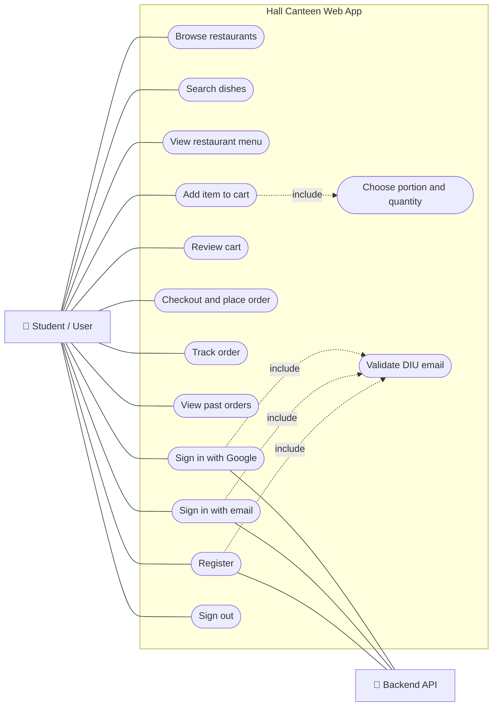
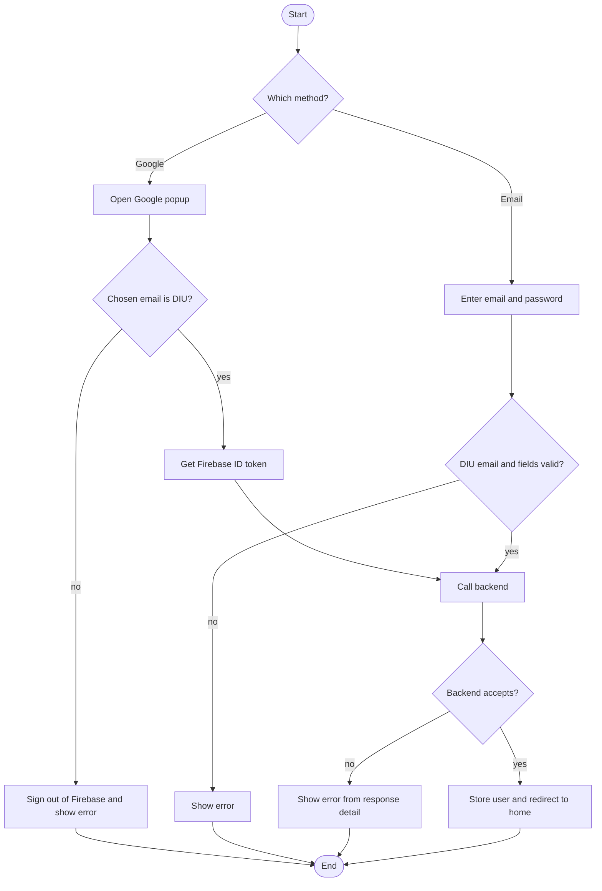
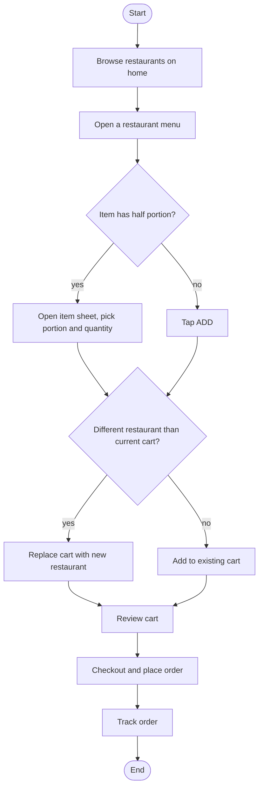
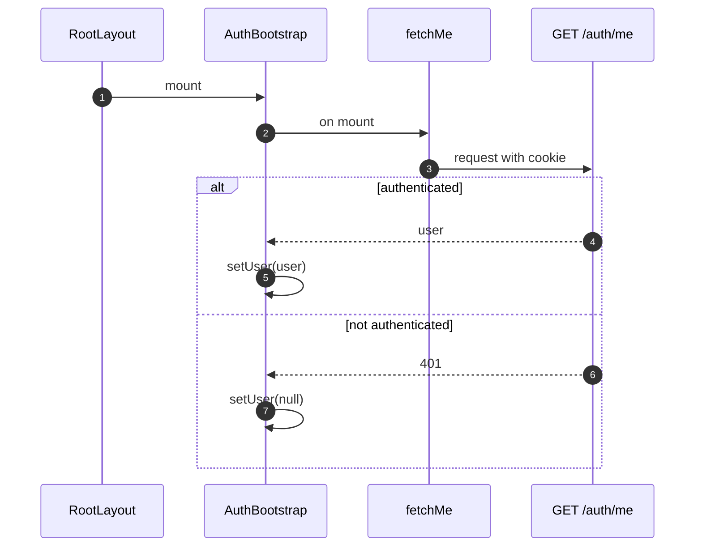
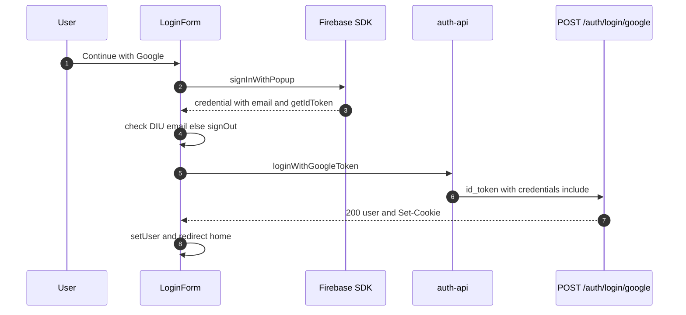
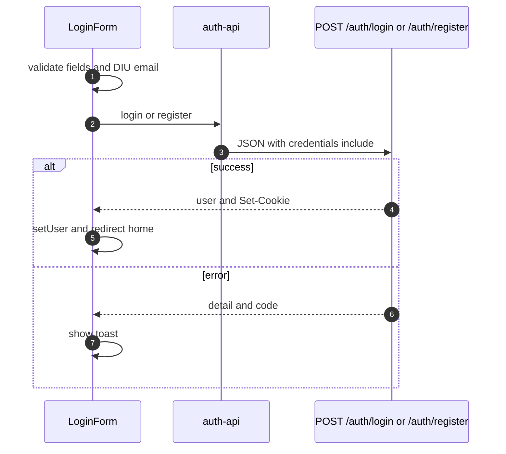
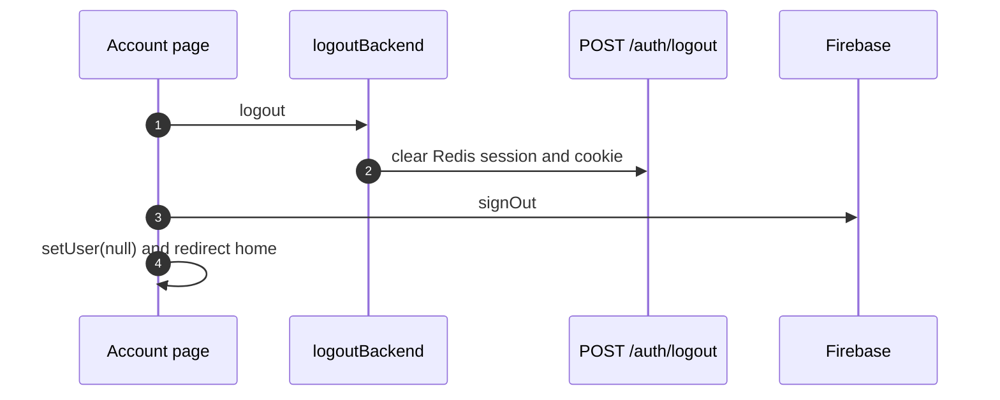

# Hall Canteen — Frontend System Design

> Single source of truth for the Next.js frontend. All diagrams are **use case**,
> **activity**, or **sequence** diagrams (Mermaid). Structural information is kept
> as tables and text.

**Stack:** Next.js 16 (App Router) · React 19 · TypeScript · Tailwind CSS v4
(`@theme`) · Lexend · hand-built shadcn-style UI · Zustand · Firebase Web SDK ·
recharts · sonner · Vercel.

---

## Table of contents

1. [Use case diagram](#1-use-case-diagram)
2. [Directory structure](#2-directory-structure)
3. [Routing map](#3-routing-map)
4. [Workflows — activity diagrams](#4-workflows--activity-diagrams)
   - [4.1 Sign in](#41-sign-in)
   - [4.2 Browse & order](#42-browse--order)
   - [4.3 Session bootstrap on load](#43-session-bootstrap-on-load)
5. [Interactions — sequence diagrams](#5-interactions--sequence-diagrams)
   - [5.1 Session bootstrap](#51-session-bootstrap)
   - [5.2 Google sign-in](#52-google-sign-in)
   - [5.3 Email sign-in / register](#53-email-sign-in--register)
   - [5.4 Logout](#54-logout)
6. [Design system](#6-design-system)
7. [State management](#7-state-management)
8. [API client & cookies](#8-api-client--cookies)
9. [Build & deployment](#9-build--deployment)

---

## 1. Use case diagram

The user's use cases. The system boundary holds the use cases; the backend is an
external actor for the auth ones. Dotted arrows are `include` relationships.



## 2. Directory structure

```
frontend/
├── src/
│   ├── app/
│   │   ├── layout.tsx               # Root: Lexend font, AuthBootstrap, Toaster
│   │   ├── page.tsx                 # "/" marketplace home (FoodShell + HomeContent)
│   │   ├── restaurants/[id]/        # Restaurant menu (server, async params)
│   │   ├── cart, checkout, track/   # Order flow
│   │   ├── search, my-orders, account/
│   │   ├── (auth)/login/            # Login page
│   │   └── (dashboard)/             # Legacy management views (menu/orders/billing/reports/styleguide)
│   ├── components/
│   │   ├── food/                    # Marketplace UI + chrome (shell/header/footer/nav, cards, modal)
│   │   ├── auth/auth-bootstrap.tsx  # Hydrates auth store from /auth/me
│   │   ├── shared/                  # wordmark, login-form, page-header, …
│   │   └── ui/                      # Hand-built shadcn-style primitives
│   ├── lib/
│   │   ├── api.ts                   # fetch wrapper (BASE_URL, credentials include)
│   │   ├── auth-api.ts              # login/register/google/me/logout
│   │   ├── firebase.ts              # env-driven Firebase init
│   │   ├── email-policy.ts          # @diu.edu.bd allow-list
│   │   └── restaurants.ts           # marketplace data + cart math + Taka format
│   ├── store/                       # Zustand: auth, food-cart, food-ui
│   ├── hooks/use-mounted.ts         # hydration-safe mounted flag
│   └── styles/globals.css           # Tailwind v4 @theme tokens
├── docs/ARCHITECTURE.md             # ← this document
└── eslint.config.mjs · next.config.ts · package.json
```

**Rendering:** Server Components by default; `"use client"` only for interactivity
(cart, item sheet, header, forms). The backend session cookie is the source of
truth; the `auth` store is a client cache hydrated from `/auth/me`.

## 3. Routing map

| Path | Purpose | Rendering |
|------|---------|-----------|
| `/` | Marketplace home (hero, meal tabs, restaurants, popular, why) | server + client islands |
| `/restaurants/:id` | Restaurant banner + category menu | server (async params) |
| `/cart` → `/checkout` → `/track` | Order flow (cart, payment, animated tracking) | client |
| `/search` | Search dishes/restaurants | client |
| `/my-orders` | Past orders | server |
| `/account` | Profile + logout | client |
| `/login` | Google + email/password | client |
| `(dashboard)`: `/menu` `/orders` `/billing` `/reports` `/styleguide` | Legacy management views | mixed |

## 4. Workflows — activity diagrams

### 4.1 Sign in



### 4.2 Browse & order



### 4.3 Session bootstrap on load

```mermaid
flowchart TD
    %% Activity diagram - session bootstrap
    start([Start]) --> a1["App loads, AuthBootstrap mounts"]
    a1 --> a2["Call GET /auth/me with cookie"]
    a2 --> d1{"Authenticated?"}
    d1 -- yes --> a3["Set user in auth store"] --> stop([End])
    d1 -- no --> a4["Clear user, browse as guest"] --> stop
```



## 5. Interactions — sequence diagrams

### 5.1 Session bootstrap



### 5.2 Google sign-in



### 5.3 Email sign-in / register



### 5.4 Logout



## 6. Design system

All tokens live in `src/styles/globals.css` inside the Tailwind v4 `@theme` block,
so the whole app re-themes from one file. Typeface: **Lexend**.

| Token | Use |
|-------|-----|
| `brand` (yellow `#F8CB46`) | cart button, accents |
| `gold` (`#E1A82B`) | the "hall" wordmark |
| `success` / `primary` (green `#0C831F`) | primary actions, ADD, veg, active nav |
| `info` (blue `#256FEF`) | discount badges |
| `muted` / `border` | section backgrounds, hairlines |

UI primitives under `components/ui/` are hand-built (shadcn-style + CVA) on the
installed Radix packages — no CLI dependency.

## 7. State management

Three Zustand stores; none of the marketplace stores are persisted, so SSR and the
first client render agree (no hydration mismatch).

| Store | Persisted | Holds |
|-------|-----------|-------|
| `auth` | yes | `user { id, name, email, role }` (cache of `/auth/me`) |
| `food-cart` | no | `cart { key → qty }`, `cartRestaurant` (one restaurant at a time; `id` / `id__half` keys) |
| `food-ui` | no | item-detail modal state (open item, portion, quantity) |

`useMounted()` (built on `useSyncExternalStore`) gates auth-dependent UI to avoid
hydration mismatches.

**Roles:** `student` (default) · `partner` (seller) · `developer` (admin, full
access). The UI gates developer-only views (reports, style guide) and
partner/developer management actions on `user.role`; the backend is the
authoritative enforcer.

## 8. API client & cookies

`lib/api.ts` prefixes `NEXT_PUBLIC_API_URL`, sends `credentials: "include"` (so the
session cookie flows), sets JSON headers, and throws `Error(detail)` on non-2xx.

- **Local dev:** frontend `:3000` and backend `:8000` are the same site
  (`localhost`), so the `SameSite=Lax` cookie works directly.
- **Production:** if hosted on different domains, route `/api/*` through a Vercel
  rewrite so calls are same-origin and the cookie stays first-party — or use
  `SameSite=None; Secure`. (See the backend doc's deployment section.)

## 9. Build & deployment

- Next 16 removed `next lint`; linting uses a flat `eslint.config.mjs`
  (`eslint-config-next` core-web-vitals + typescript).
- `NEXT_PUBLIC_*` env: `NEXT_PUBLIC_API_URL` (backend base) and the
  `NEXT_PUBLIC_FIREBASE_*` web config (public, safe to expose).
- CI (`.github/workflows`) runs install → lint → typecheck → build; the app
  deploys on Vercel.
