# Hall Canteen — Frontend System Design

> Single source of truth for the Next.js frontend: architecture, rendering model,
> routing, design system, the multi-restaurant marketplace, state management, and
> the authentication integration — with Mermaid diagrams and workflow diagrams.

**Stack:** Next.js 16 (App Router) · React 19 · TypeScript · Tailwind CSS v4
(CSS-first `@theme`) · Lexend · hand-built shadcn-style UI · Zustand · Firebase
Web SDK (Google sign-in) · recharts · sonner · deployed on Vercel.

---

## Table of contents

1. [Architecture overview](#1-architecture-overview)
2. [Rendering model (RSC vs client)](#2-rendering-model-rsc-vs-client)
3. [Directory structure](#3-directory-structure)
4. [Routing map](#4-routing-map)
5. [Design system](#5-design-system)
6. [The marketplace](#6-the-marketplace)
7. [State management](#7-state-management)
8. [Authentication integration](#8-authentication-integration)
   - [8.1 Pieces](#81-pieces)
   - [8.2 Session bootstrap](#82-session-bootstrap)
   - [8.3 Google sign-in](#83-google-sign-in)
   - [8.4 Email sign-in / register](#84-email-sign-in--register)
   - [8.5 Logout](#85-logout)
   - [8.6 DIU email restriction](#86-diu-email-restriction)
9. [API client & cross-origin cookies](#9-api-client--cross-origin-cookies)
10. [Component composition](#10-component-composition)
11. [Build & deployment](#11-build--deployment)

---

## 1. Architecture overview

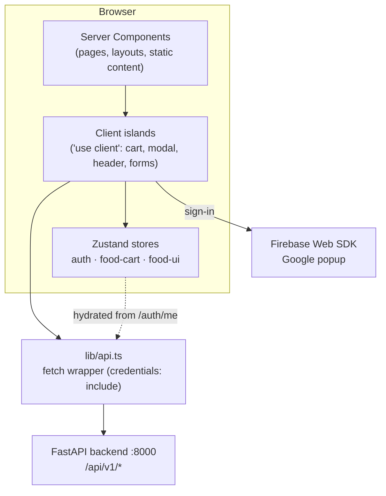

- **Server Components render the structure**; small **client islands** add
  interactivity (cart steppers, the item sheet, the header, the login form).
- The backend session (httpOnly cookie) is the **source of truth**; the Zustand
  `auth` store is a client cache hydrated from `GET /auth/me`.

## 2. Rendering model (RSC vs client)

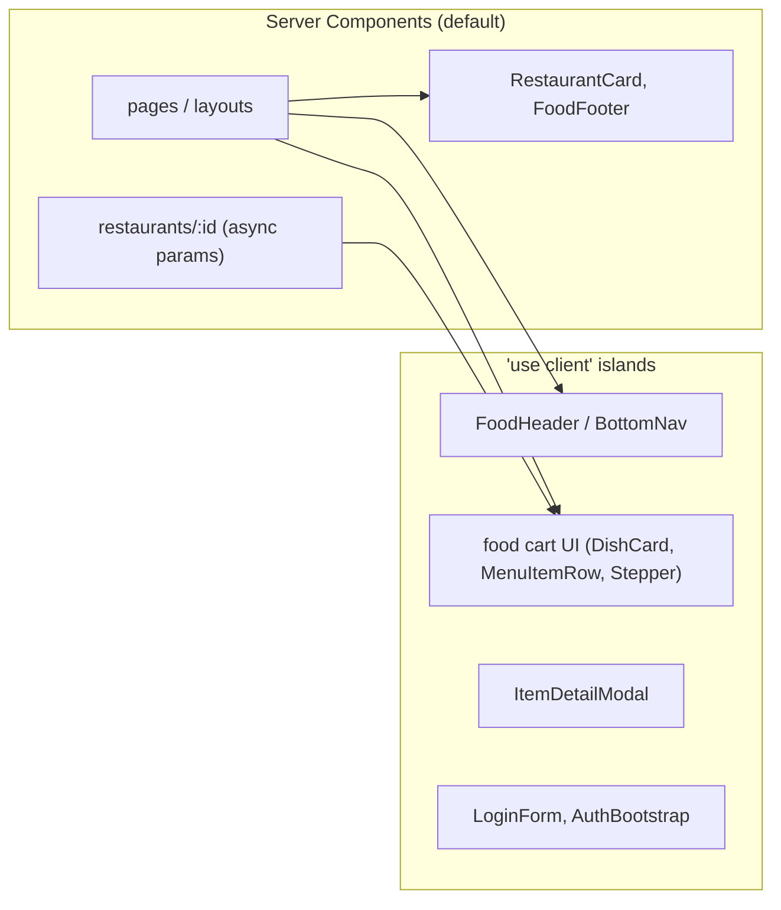

Rule of thumb: **server by default**; mark `"use client"` only when a component
uses state, effects, browser APIs, or a Zustand store.

## 3. Directory structure

```
frontend/
├── src/
│   ├── app/
│   │   ├── layout.tsx               # Root: Lexend font, <AuthBootstrap/>, <Toaster/>
│   │   ├── page.tsx                 # "/" marketplace home (FoodShell + HomeContent)
│   │   ├── restaurants/[id]/        # Restaurant menu (server, async params)
│   │   ├── cart, checkout, track/   # Order flow
│   │   ├── search, my-orders, account/
│   │   ├── (auth)/login/            # Login page
│   │   ├── (dashboard)/             # Legacy admin views (menu/orders/billing/reports/styleguide)
│   │   └── icon.tsx, apple-icon.tsx # Generated favicons
│   ├── components/
│   │   ├── food/                    # Marketplace UI + chrome (shell/header/footer/nav, cards, modal)
│   │   ├── auth/auth-bootstrap.tsx  # Hydrates auth store from /auth/me
│   │   ├── shared/                  # wordmark, login-form, page-header, …
│   │   └── ui/                      # Hand-built shadcn-style primitives (button, card, …)
│   ├── lib/
│   │   ├── api.ts                   # fetch wrapper (BASE_URL, credentials: include)
│   │   ├── auth-api.ts              # login/register/google/me/logout
│   │   ├── firebase.ts              # env-driven Firebase init
│   │   ├── email-policy.ts          # @diu.edu.bd allow-list
│   │   ├── restaurants.ts           # marketplace data + cart math + Taka format
│   │   └── utils.ts                 # cn()
│   ├── store/                       # Zustand: auth, food-cart, food-ui, cart (legacy)
│   ├── hooks/use-mounted.ts         # hydration-safe mounted flag
│   └── styles/globals.css           # Tailwind v4 @theme tokens (design system)
├── docs/ARCHITECTURE.md             # ← this document
├── eslint.config.mjs · next.config.ts · package.json
```

## 4. Routing map

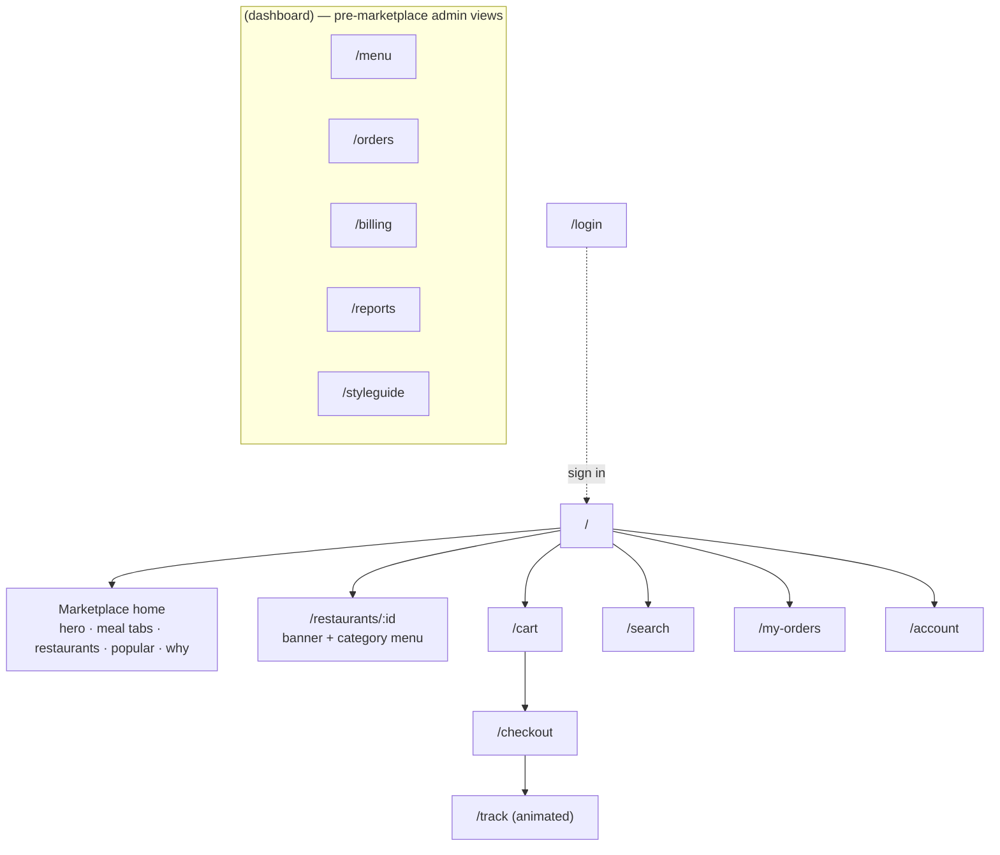

The consumer marketplace lives at the top level with its own chrome
(`FoodShell`). The `(dashboard)` group is earlier admin-style scaffolding kept
intact but unlinked from the new navigation.

## 5. Design system

All tokens live in **one place** — `src/styles/globals.css` inside the Tailwind
v4 `@theme` block — so the whole app re-themes from a single file. The palette is
a campus-food adaptation (Blinkit-inspired) with **Lexend** as the typeface.

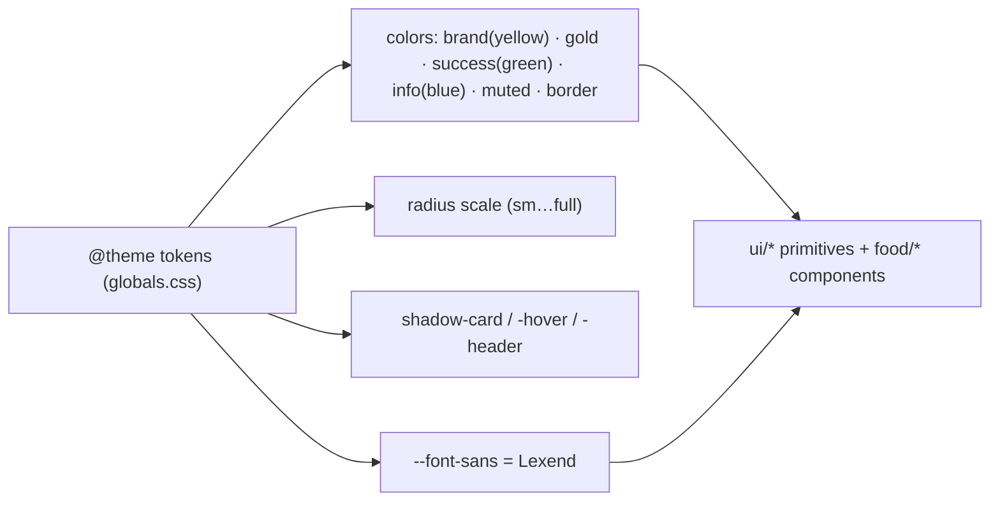

| Token | Use |
|-------|-----|
| `brand` (yellow `#F8CB46`) | cart button, accents |
| `gold` (`#E1A82B`) | the "hall" wordmark |
| `success`/`primary` (green `#0C831F`) | primary actions, ADD, veg, active nav |
| `info` (blue `#256FEF`) | discount badges |
| `muted` / `border` | section backgrounds, hairlines |

UI primitives under `components/ui/` are hand-built (shadcn-style + CVA variants)
on the installed Radix packages — no CLI dependency.

## 6. The marketplace

A multi-restaurant, Bengali campus food-delivery experience (prices in Taka ৳).
Data is in `lib/restaurants.ts` (6 restaurants, ~46 dishes) with pure helpers for
cart math.

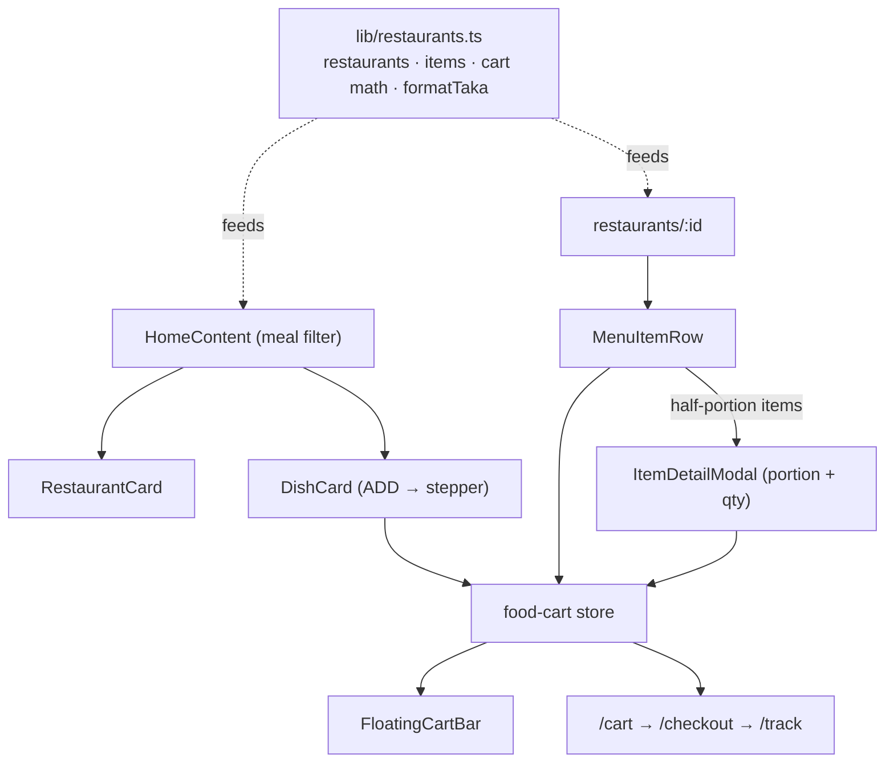

Key rule: the cart holds **one restaurant at a time** — adding from a different
restaurant clears it. Items can be added as full or half portions (keyed
`id` / `id__half`).

## 7. State management

Three Zustand stores (plus a legacy one). None of the marketplace stores are
persisted, so SSR and the first client render agree (no hydration mismatch).

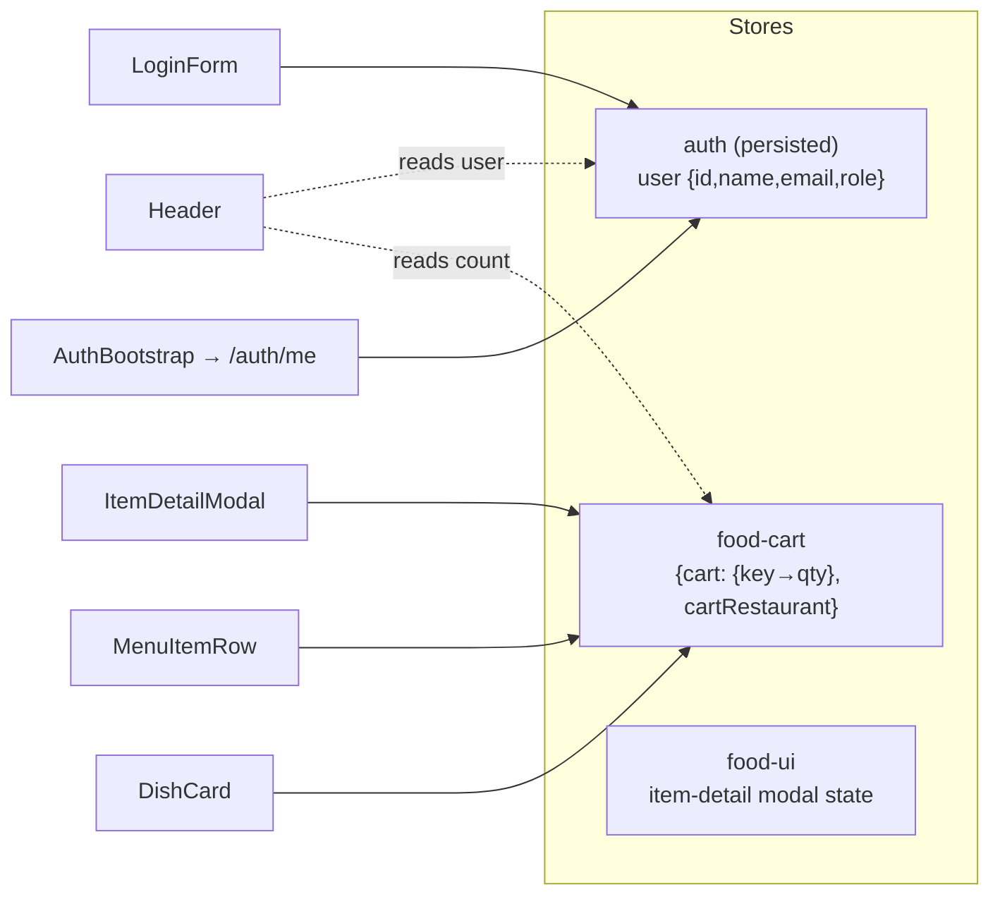

The `useMounted()` hook (built on `useSyncExternalStore`) gates rendering of
persisted/auth-dependent UI to avoid hydration mismatches.

## 8. Authentication integration

### 8.1 Pieces

| File | Role |
|------|------|
| `lib/firebase.ts` | env-driven Firebase init (Google popup only). Inert if unconfigured. |
| `lib/auth-api.ts` | `loginWithGoogleToken`, `loginWithEmail`, `registerWithEmail`, `fetchMe`, `logoutBackend` |
| `components/auth/auth-bootstrap.tsx` | calls `/auth/me` on load → hydrates the `auth` store |
| `shared/login-form.tsx` | Google + email/password UI |
| `lib/email-policy.ts` | client-side `@diu.edu.bd` check |
| `store/auth.ts` | the user cache (source of truth = backend cookie) |

### 8.2 Session bootstrap

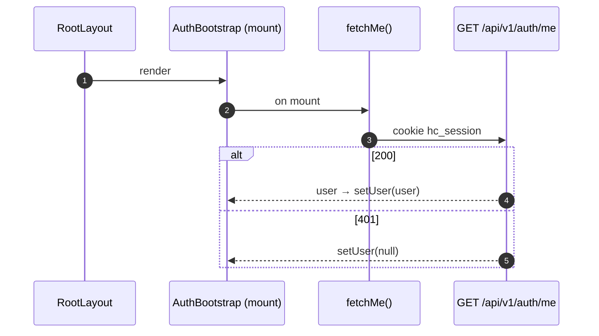

### 8.3 Google sign-in

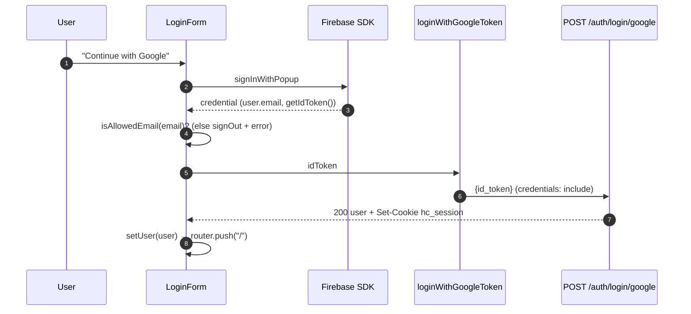

### 8.4 Email sign-in / register

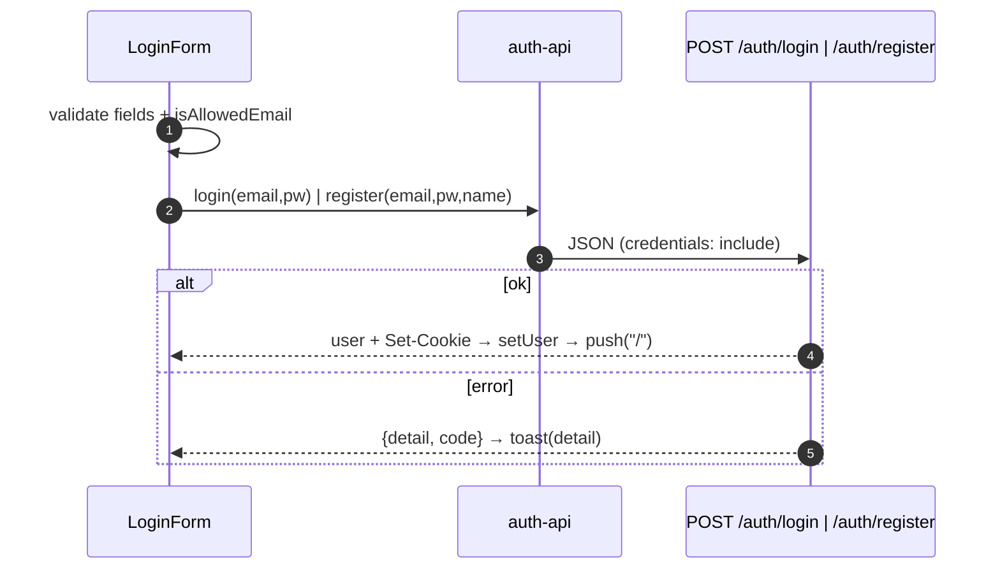

### 8.5 Logout

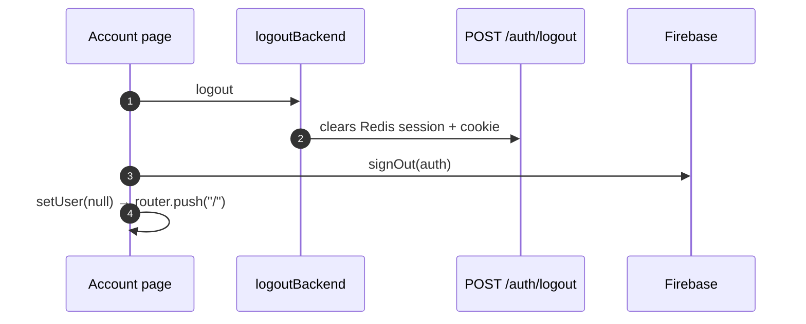

### 8.6 DIU email restriction

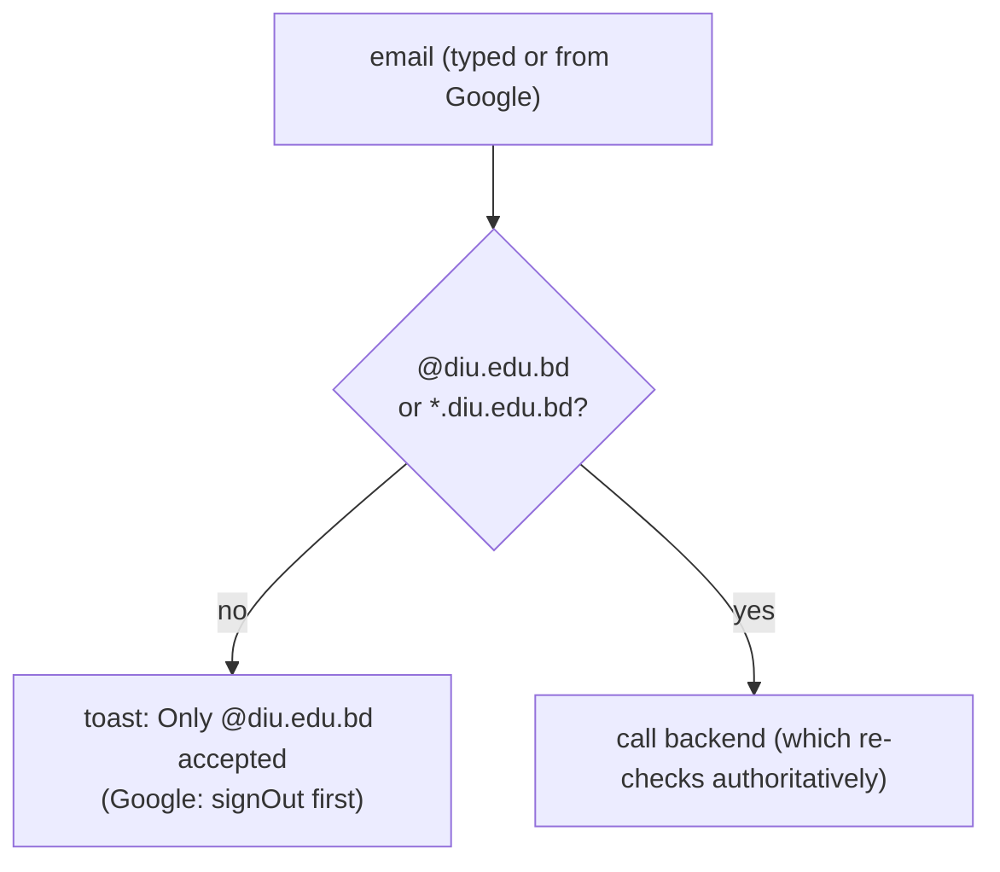

The client check is **UX only**; the backend independently enforces the same
policy and is the real gate.

## 9. API client & cross-origin cookies

`lib/api.ts` is a thin `fetch` wrapper: it prefixes `NEXT_PUBLIC_API_URL`, sends
`credentials: "include"` (so the session cookie flows), sets JSON headers, and
throws `Error(detail)` on non-2xx.

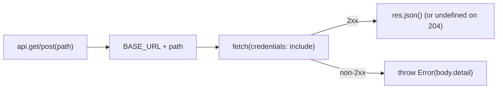

- **Local dev:** frontend `:3000` → backend `:8000` are the same site
  (`localhost`), so the `SameSite=Lax` cookie works directly.
- **Production:** if hosted on different domains, make the calls same-origin
  (route `/api/*` through a Vercel rewrite) so the cookie stays first-party, or
  use `SameSite=None; Secure`. See the backend doc's deployment section.

## 10. Component composition

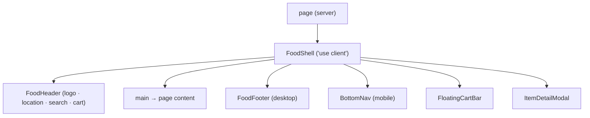

`FoodShell` provides the responsive chrome and mounts the global item-detail
modal + floating cart bar; mobile shows the bottom nav, desktop shows the footer.

## 11. Build & deployment

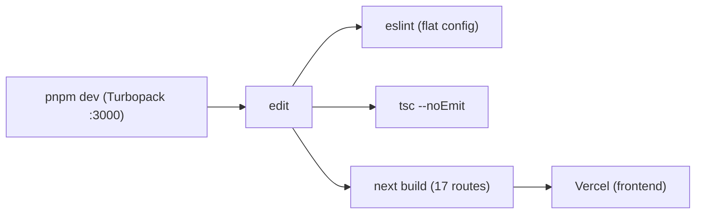

- Next 16 removed `next lint`; linting uses a flat `eslint.config.mjs`
  (`eslint-config-next` core-web-vitals + typescript).
- `NEXT_PUBLIC_*` env: `NEXT_PUBLIC_API_URL` (backend base) and the
  `NEXT_PUBLIC_FIREBASE_*` web config (public, safe to expose).
- CI (`.github/workflows`) runs install → lint → typecheck → build.
